# Android Dasar

## Sebelum Belajar

- Mengerti Pemrograman Kotlin
- Mengerti Gradle
- Sudah mengikuti Kelas Roadmap Kotlin oleh Programmer Zaman Now
- Jika susah mengukuti Kelas Roadmap Java oleh Programmer Zaman Now akan lebih baik lagi

## Agenda

- Pengenalan Android Development
- Membuat Project
- Menjalankan Project
- Activity
- Layout
- Find View
- Dan lain-lain

## #1 Pengenalan Android

### Sejarah Android

- Android adalah sistem operasi berbasis Linux yang dirancang untuk perangkat layar sentuh seperti telepon pintar atau tablet
- Android awalnya dikembangkan oleh Android Inc. Andoid Inc didirikan oleh Andy Rubin pada tahun 2003
- Google mengakuisisi Android Inc pada tahun 2005, dan menjadikan anak perusahaan sepenuhnya yang dimiliki oleh Google
- Sistem operasi Android dirilis secara resmi pada tahun 2007, dan ponsel Android pertama mulai dijual pada tahun 2008
- https://www.android.com/?hl=id

### Versi Android

- Layaknya sistem operasi, Android sendiri sudah berkembang sejak pertama kali dikenalkan
- Ketika materi ini dibuat, Android sudah versi 11
- Namun bukan berarti semua perangkat sudah menggunakan Android versi 11, bisa jadi beberapa perangkat tidak mendukung sistem operasi Android versi terbaru

### Distribusi Versi Android

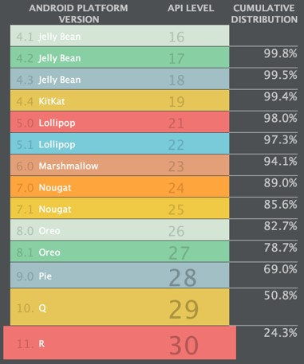

### Android Development

- Saat pertama kali dikenalkan, untuk membuat aplikasi di Android, kita bisa membuatnya menggunakan bahasa pemrograman Java
- Namun bukan berarti semua fitur pemrograman Java bisa digunakan
- Android hanya menggunakan bahasa pemrograman Java, dan sedikit fitur yang terdapat di Java
- Oleh karena itu, kita perlu belajar lagi standard library atau API yang terdapat di Android, karena walaupun menggunakan bahasa yang sama, namun teknologinya berbeda.
- https://developer.android.com/?hl=id

### Adopsi Pemrograman Kotlin

- Pada tahun 2017, Google mengumumkan bahwa Kotlin menjadi bahasa pemrograman utama yang sekarang digunakan untuk pengembangkan aplikasi Android, menggantikan Java
- Kotlin adalah bahasa pemrograman yang dibuat oleh perusahaan JetBrains yang pertama kali dirilis sekitar tahun 2011
- Saat ini, Kotlin semakin populer karena Kotlin bisa bekerja dengan baik dengan ekosistem Java, sehingga tidak hanya programmer Android, programmer Backend Java pun sekarang banyak yang menggunakan Kotlin
- https://developer.android.com/kotlin?hl=id

### Android Studio

- Android Studio adalah Integrated Developement Environment (atau text editor canggih) yang disediakan oleh Google untuk membuat aplikasi Android
- Android Studio sendiri dibangun di atas JetBrains Intellij IDEA, sehingga akan sangat familliar untuk programmer yang sebelumnya sudah menggunakan JetBrains IDE
- Android Studio bisa didapatkan dengan gratis
- https://developer.android.com/studio?hl=id

## #2 Android SDK

- Saat kita membuat aplikasi Android menggunakan Android Studio, maka kita membutuhkan Android SDK (Software Development Kit)
- Android SDK akan terinstall secara otomatis ketika pertama kali membuat project, namun kadang kita ingin menambahkan fitur atau melakukan update terhadap Android SDK yang kita install
- Kita bisa menggunakan Android Studio untuk melakukan management Android SDK

## #3 Android Compatibility

- Karena Android adalah sistem operasi yang Open Source, maka banyak sekali vendor yang membuat device yang menggunakan sistem operasi Android
- Dari mulai smartphone, tablet, smart tv sampai dashboard untuk mobil
- Oleh karena itu, kita perlu berhati-hati untuk memastikan kode program kita bisa berjalan di device yang berbeda
- Salah satu yang paling penting adalah, memilih Android API Level yang ingin kita gunakan
- Saat kita membuat aplikasi Android, kita perlu menentukan API Level minimal yang akan kita gunakan, hal ini dilakukan untuk memastikan aplikasi kita bisa berjalan dengan baik pada sistem operasi Android yang menggunakan API Level tersebut.

### Gambar API Level

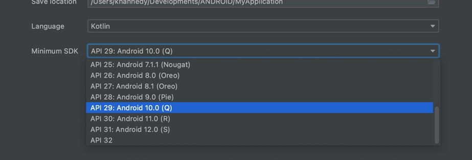

### Menentukan API Level

- Semakin tinggi API Level yang kita pilih, semakin banyak fitur yang bisa digunakan, tapi semakin sedikit juga device yang sudah menggunakan API Level tersebut
- Oleh karena itu, kita perlu hati-hati menentukan API Level minimal yang akan kita gunakan untuk membuat aplikasi Android
- Salah satu yang paling mudah, kita bisa melihat statistic pengguna device Android berdasarkan API Level nya

### Android Release Note

- Untuk melihat daftar fitur apa saja yang terdapat di versi Android tertentu, kita bisa melihat detailnya di release note Android nya
- https://developer.android.com/about/version?hl=id

## #4 Membuat Project

- Open Android Studio
- New Project
- Empty Activity
- Set Name Application
- Set Package Name (ex. com.example.app)
- Set Save Location
- Set Language (Kotlin, Java)
- Set Minimum SDK
- Finish

## #5 Struktur Project


## #6 Gradle

- Android menggunakan Gradle untuk project management nya, oleh karena itu di awal saya jelaskan bahwa teman-teman harus mengerti tentang Kotlin dan Gradle
- Secara default, Android Studio akan membuat multi module Gradle Project, dimana hanya terdapat 1 module, yaitu app

## #7 Android Virtual Device

- Saat kita membuat aplikasi Android, kita tidak bisa menjalankan aplikasinya di sistem operasi Windows, Mac atau Linux yang kita gunakan
- Kita membutuhkan sistem sistem operasi Android untuk menjalankan aplikasi Android kita
- Ada dua cara menjalankan aplikasi Android kita, pertama menggunakan device Android kita, kedua membuat Virtual Device
- Dan untungnya Android SDK mendukung kita untuk membuat Virtual Device, sehingga akan memudahkan kita menjalankan sistem operasi Android secara virtual

### Membuat Virtual Device

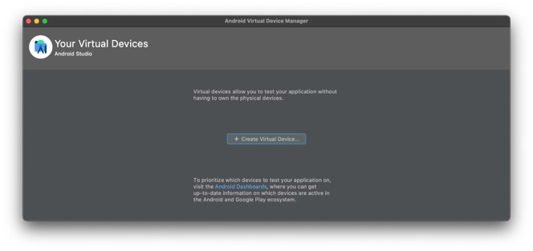

- Tools -> AVD Manager
- Create Virtual Device
- Choose a device definition
- Phone -> Pixel 5
- Select a system image

## #8 Android Development Mode

- Selain menggunakan Android Virtual Device, kita juga bisa menggunakan smartphone Android untuk mencoba aplikasi Android kita
- Namun sebelum kita bisa menggunakan smartphone Android kita, terlebih dahulu kita perlu menjalankan Development Mode di smartphone Android kita
- Biasanya tiap merek smartphone memiliki cara tersendiri-sendiri untuk mengaktifkan Development Mode, oleh karena itu disarankan untuk mencari di internet cara mengaktifkan Development Mode pada merek smartphone yang kita gunakan

### Windows

- Khusus jika kita menggunakan WIndows, kita juga perlu menginstall Driver agar smartphone Android kita bisa terdeteksi
- https://developer.android.com/studio/run/oem-usb?hl=id

## #9 Build Configuration

### Android Build System

- Android build system akan melakukan kompilasi aplikasi dari kode program dan resource dan mem-package semuanya menjadi sebuah aplikasi Android
- Android Studio menggunakan Gradle, untuk melakukan otomatisasi semua proses tersebut, sehingga kita tidak perlu melakukannya secara manual lagi menggunakan Android Build System
- Gradle dan Android Build System sendiri sebenarnya bisa berjalan secara independen, oleh karena itu kita wajib menggunakan Android Studio, namun dengan menggunakan Android Studio, akan mempermudah kita ketika membuat aplikasi Android

### Proses Build

- Compiler akan melakukan kompilasi semua kode kita menjadi DEX (Dalvix Executable) file
- API Packager akan menandai file apakah ini versi debug atau release, sebelum akhirnya dijadikan aplikasi file APK (Android Application Package)

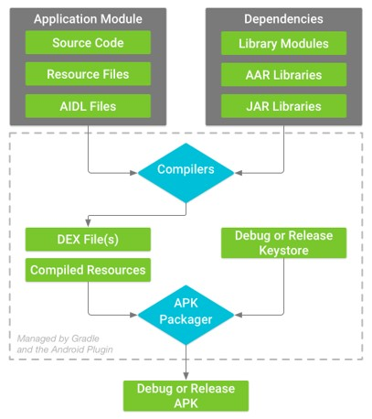

### Konfigurasi Modul Aplikasi

- Setiap module di project, terdapat gradle file build.build yang berisikan konfigurasi dari module aplikasi
- Kita perlu menentukan konfigurasi pada modul aplikasi sesuai dengan build configuration yang kita gunakan, misal kita harus pastikan sdk dan target sdk nya sesuai dengan yang kita gunakan misalnya
- Selain kita perlu menentukan applicationId, yang mana itu adalah id dari aplikasi kita, dan harus unik secara global tidak boleh ada yang sama

### Kode : Build Configuration

```
android {
    compileSdk 32

    defaultConfig {
        applicationId "com.example.app"
        minSdk 29
        targetSdk 32
        versionCode 1
        versionName "1.0"

        testInstrumentationRunner "androidx.test.runner.AndroidJUnitRunner"
    }
}
```

## #10 Menjalankan Aplikasi

### Android Application Pacakage

- Sebelum menjalankan aplikasi kita, kita perlu mem-package aplikasi Android kita dalam format APK (Android Application Package)
- Namun hal ini tidak perlu kita lakukan manual, karena secara otomatis Android Studio akan menggunakan Gradle untuk membuat APK secara otomatis, lalu mengirimkannya ke Device Android yang kita pilih (Virtual Device atau Device Asli)

## #11 Manifest File

- Setiap project Android, wajib memiliki Manifest File yaitu AndroidManifest.xml
- Manifest File beriskan informasi dari aplikasi yang kita buat, seperti informasi Activity, Permission, Intent, Provider, Receiver, Service, dan lain-lain
- https://developer.android.com/guide/topics/manifest/manifest-intro?hl=id

### Kode : Contoh Manifest File

```xml
<?xml version="1.0" encoding="UTF-8"?>
<manifest xmlns:android="http://schemas.android.com/apk/res/android"
	package="com.programmerzamannow.helloworld">

	<application
		android:allowBackup="true"
		android:icon="@mipmap/ic_launcher"
		android:label="@string/app_name"
		android:roundIcon="@mipmap/ic_launcher_round"
		android:supportsRtl="true"
		android:theme="@style/Theme.HelloWorld">
		<activity
			android:name=".MainActivity"
			android:exported="true">
			<intent-filter>
				<action android:name="android.intent.action.MAIN" />

				<category androi:name="android.intent.category.LAUNCHER" />
			</intent-filter>

		</activity>
	</application>

</manifest>
```

## #12 Activity

- Saat kita membuat aplikasi seperti di Java atau di Kotlin, biasanya ketika akan membuat main function sebagai function yang akan diluncurkan ketika aplikasi berjalan
- Di Android tidak seperti itu, Android memiliki fitur yang bernama Activity, dimana nanti object Activity tersebut akan secara otomatis dijalankan oleh Android
- Pada kelas ini kita tidak akan membahas detail tentang Activity, kita akan membahasnya nanti di kelas khusus tentang Activity, karena materi Activity sangat banyak

### Class Activity

- Untuk membuat Activity, kita perlu membuat class turunan dari Activity
- Saat kita membuat project Android, secara otomatis akan ada sebuah MainActivity yang merupakan class turunan dari AppCompactActivity
- AppCompactActivity merupakan turunan dari class Activity yang memungkinkan kita menggunakan fitur baru Androud di versi Android lama, oleh karena itu direkomendasikan menggunakan class AppCompactActivity
- https://developer.android.com/reference/android/app/Activity

### Mendaftarkan Activity

- Untuk memberitahu kepada Android, bahwa kita membuat Activity, kita harus mendaftarkanya di Manifest File
- Selain itu, kita perlu menambahkan intent untuk menambahkan informasi seperti misalnya, menandai sebuah Activity ini adalah Main Activity, dan menandai bahwa Activity ini harus dijalankan ketika aplikasi Android diluncurkan/dibuka (LAUNCH)

### Kode : Contoh Manifest File

```xml
<activity
    android:name=".MainActivity"
    android:exported="true">
    <intent-filter>
        <action android:name="android.intent.action.MAIN" />

        <category android:name="android.intent.category.LAUNCHER" />
    </intent-filter>
</activity>
```

### Activity Callback

- Activity itu memiliki banyak sekali function, nanti kita akan bahas di kelas tersendiri
- Salah satu function yang dipanggil ketika Activity dibuat adalah onCreate()

### Kode : Activity onCreate()

```kt
class MainActivity : AppCompactActivity() {

    override fun onCreate(savedInstanceState: Bundle?) {
        super.onCreate(savedInstanceState)
        setContentView(R.layout.activity_main)
    }
}
```

## #13 Layout

- Activity bukanlah tampilan UI, tapi biasanya Activity itu akan menampilkan tampilan UI
- Android memisahkan antara kode program dan tampilan UI, namanya adalah Layout
- Layout merupakan kode yang berisikan tampilan UI
- Layout di Android menggunakan XML, sehingga yang terbiasa menggunakan HTML akan mudah beradaptasi

### R Class

- Saat kita membuat Layout baru, secara otomatis Android akan melakukan auto sebuah variable berisikan id layout yang sesuai dengan nama Layout nya
- Dan untuk menentukan Layout mana yang akan ditampilkan di Activity, kita bisa menggunakan function setContentView(layout_id)

### Kode : Layout

```xml
<?xml version="1.0" encoding="utf-8"?>
<LinearLayout
    xmlns:android="http://schemas.android.com/api/res/android"
    android:layout_width="match_parent"
    android:layout_height="wrap_parent"
    android:layout_gravity="center_vertical"
    android:orientation="vertical"
    >

</LinearLayout>
```

### Kode : Activity

```kt
class MainActivity : AppCompactActivity() {

	override fun onCreate(saveInstanceState: Bundle) {
		super.onCreate(saveInstanceState)
		setContentView(R.layout.hello_world)
	}
}
```

## #14 View

- Semua komponen UI di Android adalah turunan View
- Ada banyak sekali komponen yang terdapat di Android, dan akan dibahas di kelas terpisah
- Bahkan Layout sendiri adalah turunan dari class View
- https://developer.android.com/reference/android/view/View

### Menambah View

- Untuk menambahkan View, kita bisa menyebutkan View yang ingin kita gunakan di Layout yang sudah di kita buat
- Setiap komponen View memiliki banyak atribut yang bisa kita ubah, misal Button Label dan Text memiliki atribut text yang bisa kita ubah untuk mengubah tulisan text nya

### Kode : Menambah View

```xml
<TextView
    android:layout_width="wrap_content"
    android:layout_height="wrap_content"
    android:layout_gravity="center_horizontal"
    android:text="Name" />

<TextEdit
    android:layout_width="wrap_parent"
    android:layout_height="wrap_content"
    android:layout_gravity="center_horizontal" />

<Button
    android:layout_width="wrap_content"
    android:layout_height="wrap_content"
    android:layout_gravity="center_horizontal"
    android:text="Say Hello" />

<TextView
    android:layout_width="wrap_content"
    android:layout_height="wrap_content"
    android:layout_gravity="center_horizontal" />
```

## #15 View ID

### FInd View by Id

- Saat kita menambahkan komponen ke Layout, kadang kita ingin menambahkan object dari komponen tersebut
- Caranya adalah kita bisa menggunakan function findViewById()
- Namun sebelum kita bisa menggunakan function tersebut, kita perlu menambahkan id terhadap komponen yang ingin kita ambil objectnya

### View ID

- Untuk menambahkan View ID, kita menambahkan atribut id pada komponen nya
- Namun caranya kita perlu menggunakan nama @+id/namaIdNya
- Android Build System akan secara otomatis membuatkan id tersebut sebagai id component di class R, mirip seperti pada Layout
- Best Practice penamaan view ID adalah nama diikuti dengan jenis komponen, misal : nameEditText, sayHelloButton, firstNameEditText, lastNameEditText, regiterButton, dan lain-lain

### Kode : View ID

```xml
<TextView
    android:layout_width="wrap_content"
    android:layout_height="wrap_content"
    android:layout_gravity="center_horizontal"
    android:text="Name" />

<TextEdit
    android:id="@+id/nameEditText"
    android:layout_width="wrap_parent"
    android:layout_height="wrap_content"
    android:layout_gravity="center_horizontal" />

<Button
    android:id="@+id/sayHelloButton"
    android:layout_width="wrap_content"
    android:layout_height="wrap_content"
    android:layout_gravity="center_horizontal"
    android:text="Say Hello" />

<TextView
    android:id="@+id/sayHelloTextView"
    android:layout_width="wrap_content"
    android:layout_height="wrap_content"
    android:layout_gravity="center_horizontal" />
```

### Kode : Find View by Id

```kt
class MainActivity : AppCompactActivity() {

    override fun onCreate(savedInstanceState: Bundle?) {
        super.onCreate(savedInstanceState)
        setContentView(R.layout.hello_world)

        val nameEditText: EditText = findViewById(R.id.nameEditText)
        val sayHelloButton: Button = findViewById(R.id.sayHelloButton)
        val sayHelloTextView: TextView = findViewById(R.id.sayHelloTextView)

        sayHelloTextView.text = "Hi"
    }
}
```

## #16 Action Listener

- Beberapa jenis component memiliki Action Listener
- Yaitu object yang bisa kita tambahkan ke komponen ketika sebuah aksi dilakukan ke komponen tersebut
- Detail dari Action Listener akan kita bahas di kelas khusus membahas Android View
- Contoh sederhana, pada Button, terdapat Click Listener yang bisa digunakan untuk menambahkan object Listener ketika tombol di Click menggunakan function setOnClickListener(listener)

### Kode : Action Listener

```kt
val nameEditText: EditText = findViewById(R.id.nameEditText)
val sayHelloButton: Button = findViewById(R.id.sayHelloButton)
val sayHelloTextView: TextView = findViewById(R.id.sayHelloTextView)

sayHelloTextView.text = "Hi"

sayHelloButton.setOnClickListener {
    val name = nameTextEdit.text.toString()
    sayHelloTextView.text = "Hi $name"
}
```

## #17 Lateinit

### Masalah Dengan Find View By Id

- Saat kita menggunakan function findViewById(), maka aplikasi kita akan secara otomatis mencari View berdasarkan id kita
- Saat komponen dan layout kita masih sedikit, maka menggunakan findViewById() secara terus menerus tidak akan bermasalah, namun saat nanti komponen dan layout kita semakin banyak, maka akan membuat kode program kita semakin lambat
- Oleh karena itu tidak disarankan selalu menggunakan function ini setiap kali kita butuh komponen

### Lateinit

- Salah satu rekomendasinya adalah kita simpan object komponen nya sebagai variable di class nya
- Namun karena pada kotlin jika kita ingin membuat variable yang bisa nullable harus menggunakan tanda ?, namun agar lebih mudah, kita bisa menggunakan lateinit, agar variable yang kita buat tidak perlu menjadi nullable

### Kode : Lateinit

```kt
private lateinit var nameEditText: EdiText
private lateinit var sayHelloButton: Button
private lateinit var sayHelloTextView: TextView

private fun initComponents() {
    nameEditText = findViewById(R.id.nameEditText)
    sayHelloButton = findViewById(R.id.sayHelloButton)
    sayHelloTextView = findViewById(R.id.sayHelloTextView)
}

override fun onCreate(savedInstanceState: Bundle?) {
    super.onCreate(savedInstanceState)

    setContentView(R.layout.hello_world)

    initComponents()
}
```

## #18 Log

- Saat kita membuat kode program Kotlin atau Java, kita sering melakukan println atau menulis tulisan ke console
- Di Android, kita juga bisa melakukan hal tersebut dengan menggunakan class Log
- Lebih tepatnya Log ini digunakan untuk melakukan logging di Android
- https://developer.android.com/reference/android/util/Log

### Log Level

- Berbeda dengan println biasanya, pada Log, terdapat yang namanya Level, yaitu level informasi yang ingin kita tampilkan
- Android mendukung beberapa jenis Log Level

### Jenis Log Level

| Log Level | Function                         |
| --------- | -------------------------------- |
| VERBOSE   | Log.v(tag, message?, throwable?) |
| DEBUG     | Log.d(tag, message?, throwable?) |
| INFO      | Log.i(tag, message?, throwable?) |
| WARN      | Log.w(tag, message?, throwable?) |
| ERROR     | Log.e(tag, message?, throwable?) |

### Kode : Log

```kt
sayHelloButton.setOnClickListener {
    Log.i("PZN", "click say hello button")
}
```

### Hasil Log

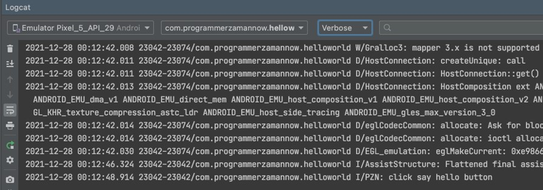

## #19 Resource

- Resource adalah file tambahan atau konten statis yang biasanya digunakan di kode program kita
- Seperti contohnya text, gambar, layout, animasi, dan lain-lain
- Androud sendiri mendukung banyak sekali resource, kita akan bahas secara bertahap
- Pertanyaannya, bagaimana untuk mengambil data resource nya?
- Untuk mengambil data resource nya, kita bisa menggunakan class Resources

- https://developer.android.com/reference/android/content/res/Resources

### Jenis-Jenis Resource

| Resource Directory | Keterangan                                                        |
| ------------------ | ----------------------------------------------------------------- |
| animator           | XML file definisi property animations                             |
| anim               | XML file definisi tween animations                                |
| color              | XML file definisi warna                                           |
| drawable           | Bitmap files (png, jpg, gif) atau XML file drawable resrouce      |
| mipmap             | Drawable file untuk icon launcher                                 |
| layout             | XML file definisi layout user interface                           |
| menu               | XML file definisi app menu                                        |
| raw                | File yang utuh lainnya                                            |
| values             | XML file yang berisi value seperti string, integer, dan lain-lain |
| xml                | XML file yang bisa dibaca menggunakan Resources.getXML()          |
| font               | Font files                                                        |

### Pembahasan Resources

- Pada kelas ini, kita tidak akan membahas semua Resources yang ada di Android, karena tiap jenis resource perlu topik masing-masing
- Contohnya seperti animator atau anim, kita perlu mengenal penggunaan graphics terlebih dahulu di Android, sebelum menggunakan resource tersebut
- Pada kelas ini, kita akan fokus membahas jenis resource dasar yang memang bisa langsung digunakan seperti values atau layout

### Resources di Activity

- Class Resources secara otomatis akan dibuatkan di dalam Android Context, dimana Activity adalah turunan dari Android Context
- Untuk mendapatkan object Resources, kita bisa langsung menggunakan function getResources(), atau jika menggunakan Kotlin, kita bisa langsung panggil property resources

### Mengakses Resource

- Setiap kita membuat Resource, secara otomatis resource tersebut akan memiliki id yang secara otomatis ditambahkan ke class R
- Dengan demikian, untuk mengakses resource id nya di kide program kita, kita bisa langung menggunakan class R
- Namun resource juga bisa dipanggil dari resource lainnya, pada kasus ini, kita bisa menggunakan id resource diawal dengan @ dan jenis resource, lalu diikuti dengan id resource, misal @string/id_string
- Contonya pada layout, ketika kita membuat text di button, kita ingin mengisi text nya dari resource string misalnya

### Kode : Resources

```kt
override fun onCreate(savedInstanceState: Bundle?) {
    super.onCreate(savedInstanceState)

    setComponentView(R.layout.hello_world)

    initComponents()

    sayHelloTextView.text = resources.getText(R.string.app_name)
}
```

## #20 String Resource

## Values Resource

- Values resource merupakan jenis resource yang bisanya digunakan untuk menyimpan data-data statis yang digunakan di kode program kita, misal string, integer, boolean, color, dan lain-lain

## String Resource

- String merupakan resource yang berisi teks
- Rekomendasinya ketika kita membuat tulisan untuk kita tampilan di halaman UI aplikasi Android kita, disarankan jangan meng-hardcode pada kode program, lebih baik menggunakan String resource
- Hal ini karena jika kita ingin mengubah text nya, tidak perlu mengubah kode program, selain itu data text nya bisa digunakan ulang di halaman UI berbeda

### Kode : String Resource

```xml
<resources>
    <string name="app_name">Hello World</string>
    <string name="nameTextEdit">Name:</string>
    <string name="sayHelloButton">Say Hello</string>
</resources>
```

### Kode : String Resource di Layout

```xml
<TextView
    android:layout_width="wrap_parent"
    android:layout_height="wrap_content"
    android:layout_gravity="center_horizontal"
    android:text="@string/nameEditText" />

<TextEdit
    android:id="@+id/nameEditText"
    android:layout_width="wrap_parent"
    android:layout_height="wrap_content"
    android:layout_gravity="center_horizontal" />

<Button
    android:id="@+id/sayHelloButton"
    android:layout_width="wrap_content"
    android:layout_height="wrap_content"
    android:layout_gravity="center_horizontal"
    android:text="@string/sayHelloButton" />
```

### Formatting String

- Kadang saat menggunakan String resource, kita butuh membuat String yang datanya dinamis dan memiliki parameter, contoh kasus kita adalah tulisan `Hello $name`
- Artinya $name tersebut bisa berubah-berubah
- Untung nya String resource mendukung hal tersebut, kita bisa menggunakan formatting string pada string resource, caranya cukup gunakan format `%index$s` untuk parameter string, atau `%index$d` untuk angka desimal

### Kode : String Resource

```xml
<resources>
    <string name="app_name">Hello World</string>
    <string name="nameTextEdit">Name:</string>
    <string name="sayHelloButton">Say Hello</string>
    <string name="sayHelloTextView">Hello %1$s</string>
</resources>
```

### Kode : Formatting String

```kt
override fun onCreate(savedInstanceState: Bundle?) {
    super.onCreate(savedInstanceState)

    setComponentView(R.layout.hello_world)

    initComponents()

    sayHelloButton.setOnClickListener {
        Log.i("PZN", "click say hello button")
        val name = nameEditText.text.toString()
        sayHelloTextView.text = resources.getText(R.string.sayHelloTextView, name)
    }
}
```

### String Array Resource

- Values resource juga bisa kita tambahkan tipe resource berupa String Array
- Kita bisa menggunakan tag `<string-array>` untuk menambahkan tipe String Array Resource
- Dan di dalamnya untuk menambahkan tiap datanya, kita bisa gunakan tag `<item>`
- String Array Resource secara otomatis akan terdapat di property array di class R
- Untuk mengambil String Array Resource, kita bisa gunakan function getStringArray(resourceId)

### Kode : String Array Resource

```xml
<resources>
    <string name="app_name">Hello World</string>
    <string name="nameTextEdit">Name:</string>
    <string name="sayHelloButton">Say Hello</string>
    <string name="sayHelloTextView">Hello %1$s</string>
    <string-array name="names">
        <item>Eko</item>
        <item>Kurniawan</item>
        <item>Khannedy</item>
    </string-array>
</resources>
```

### Kode : Mengambil String Array Resource

```kt
sayHelloButton.setOnClickListener {
    Log.i("PZN", "click say hello button")
    val name = nameEditText.text.toString()

    resources.getStringArray(R.array.names).forEach {
        Log.i("PZN", it)
    }
}
```

## #21 Value Resource Lainnya

- Selain String Resource dan String Array Resource, di dalam Value Resource, kita bisa menambahkan banyak jenis Resource Lainnya
- Misalnya Integer, Integer Array, Boolean, Color dan lain-lain
- https://developer.android.com/guide/topics/resources/more-resources?hl=id

### Kode : Value Resource Lainnya

```xml
<?xml verision="1.0" encoding="utf-8" ?>
<resources>
    <integer name="maxPaging">100</integer>
    <integer-array name="numbers">
        <item>100</item>
        <item>200</item>
        <item>300</item>
    </integer-array>
    <bool name="isProductionMode">true</bool>
    <color name="background">#FF0000</color>
</resources>
```

### Kode : Menggunakan value Resource Lainnya

```kt
sayHelloButton.setOnClickListener {

    Log.i("ValueResource", resources.getBoolean(R.bool.isProductionMode).toString())
    Log.i("ValueResource", resources.getInteger(R.integer.maxPaging).toString())
    Log.i("ValueResource", resources.getIntArray(R.array.isProductionMode).joinToString(","))
    Log.i("ValueResource", resources.getColor(R.color.background, theme).toString())

    sayHelloButton.setBackgroundColor(resources.getColor(R.color.background, theme))
}
```

## #22 Layout Resource

- Layout resource adalah definisi dari tampilan untuk UI
- Di dalam layout, kita bisa mendefinisikan isi View atau ViewGroup
- View adalah single komponen, sedangkan ViewGroup adalah container atau wadah untuk satu atau lebih komponen View
- Contoh ViewGroup seperti LinearLayout, RelativeLayout, FrameLayout, dan lain-lain
- Layout juga bisa menambahkan layout lain, dengan menggunakan tag `<include>`
- Setiap layout harus memiliki satu root element, jika misal kita ingin memiliki root element, misal untuk digunakan sebagai include di layout lain, kita bisa gunakan root tag `<merge>`

### Kode : Layout

```xml
<?xml version="1.0" encoding="utf-8"?>
<merge xlmns:android="http://schemas.android.com/apk/res/android">
	<TextView
	    android:layout_width="wrap_parent"
	    android:layout_height="wrap_content"
	    android:layout_gravity="center_horizontal"
	    android:text="@string/nameEditText" />

	<TextEdit
	    android:id="@+id/nameEditText"
	    android:layout_width="wrap_parent"
	    android:layout_height="wrap_content"
	    android:layout_gravity="center_horizontal" />

	<Button
	    android:id="@+id/sayHelloButton"
	    android:layout_width="wrap_content"
	    android:layout_height="wrap_content"
	    android:layout_gravity="center_horizontal"
	    android:text="@string/sayHelloButton" />
</merge>
```

### Kode : Layout Include

```xml
<?xml version="1.0" encoding="utf-8"?>
<LinearLayout xlmns:android="http://schemas.android.com/apk/res/android"
	android:layout_width="match_parent"
	android:layout_height="wrap_parent"
	android:layout_gravity="center_vertical"
	android:orientation="vertical">

	<include layout="@layout/say_hello_form"/>

	<TextView
		android:id="@id/sayHelloTextView"
		android:layout_width="wrap_content"
		android:layout_height="wrap_content"
		android:layout_gravity="center_horizontal" />

</LinearLayout>
```

## #23 Color State List Resource

- Color State List Resource merupakan object yang bisa kita buat dalam XML yang merupakan representasi Color (Warna), tapi tidak satu Color, melainkan bisa bebrapa Color tergantung state dari View nya
- Color State List Resource di representasikan dalam class ColorStateList https://developer.android.com/reference/android/content/res/ColorStateList
- Contoh State List Resource juga bisa menggunakan Color Resource yang sudah kita buat di Values Resource dengan menggunakan @color/namaResource
- https://developer.android.com/guide/topics/resources/color-list-resource?hl=id

### Kode : Color State List Resource

```xml
<?xml version="1.0" encoding="utf-8"?>
<selector xlmns:android="http://schemas.android.com/apk/res/android">
	<item android:color="#FFFF00" android:state_pressed="true"/>
	<item android:color="#FFFFFF" android:state_focused="true"/>
	<item android:color="@color/background"/>
</selector>
```

### Kode : Menggunakan Color State List

```xml
<Button
    android:id="@+id/sayHelloButton"
    android:layout_width="wrap_content"
    android:layout_height="wrap_content"
    android:layout_gravity="center_horizontal"
    android:text="@string/sayHelloButton"
    android:textColor="@color/say_hello" />
```

## #24 Drawable Resource

- Drawable Resource adalah jenis resource dengan konsep graphics yang bisa digambar di layar
- Ada banyak jenis Drawable, seperti Bitmap File (file gambar), Nine Patch File, Layer List, State List dan lain-lain
- https://developer.android.com/guide/topics/resources/drawable-resource?hl=id
- Drawable direpresentasikan dalam class Drawable dan untuk mendapatkannya, kita bisa gunakan function `getDrawable(resourceId)` pada class Resources
- https://developer.android.com/reference/android/graphics/drawable/Drawable

### Menambah Drawable


### Kode : Menggunakan Drawable

```xml
<?xml version="1.0" encoding="utf-8"?>
<LinearLayout xlmns:android="http://schemas.android.com/apk/res/android"
	android:layout_width="match_parent"
	android:layout_height="wrap_parent"
	android:layout_gravity="center_vertical"
	android:orientation="vertical">

	<ImageView
		android:layout_width="100dp"
		android:layout_height="100dp"
		android:layout_gravity="center_horizontal"
		android:contentDescription="PZN Logo"
		android:src="@drawable/pzm" />

</LinearLayout>

```

## #25 Localization

- Saat kita membuat aplikasi Android, kadang aplikasi yang kita buat akan diakses dari berbagai negara menggunakan berbagai bahasa
- Agar aplikasi kita bisa gunakan oleh banyak orang, ada baiknya kita membuat text, files, number, gambar dan lain-lain sesuai dengan lokasi pengguna
- Android mendukung fitur Localization, dimana kita membuat resource yang kita buat bisa menyesuaikan dengan bahas yang digunakan oleh pengguna aplikasi kita

### Default Resource

- Saat kita membuat resource, maka Android kaan mengakses default resource, contoh default values resource akan diambil dari `res/values/namafile.xml`
- Jika tidak ada default resource, maka akan terjadi error yang menyebabkan aplikasi kita tidak bisa berjalan

### Localization Resource

- Setelah kita membuat default resource, selanjutnya kita bisa membuat resource alternatif untuk bahas lain
- Caranya kita bisa mambuat resource dengan nama `res/{type}-{locale}/namafile.xml`
- Misal `res/values-in/string.xml` untuk values resource bahasa indonesia
- Misal `res/drawable-in/pzn.png` untuk drawable resource bahas indonesia
- Saat kita membuat resource alternatif, jika ternyata resource dengan id yang dimaksud tidak tersedia, maka secara otomatis akan menggunakan default resource

### Resource Localization

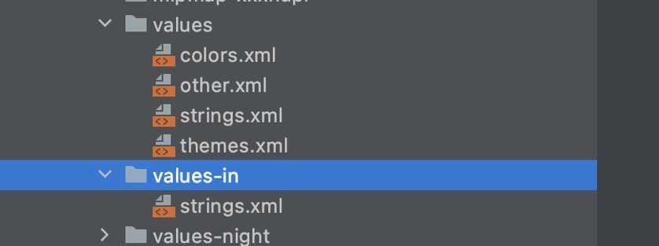

### Kode : Values Resource Localization

```xml
<resource>
	<string name="app_name">Hello Dunia</string>
	<string name="nameEditText">Nama:</string>
	<string name="sayHelloButton">Ucapkan Halo</string>
	<string name="satHelloTextView">Hello %1$s</string>
</resource>
```

## #26 Asset Manager

- Kadang kita ingi menambahkan resource di Aplikasi Android kita, tapi bukan resource yang di manage oleh Android, misal kita ingin menambahkan file JSON atau TXT misalnya
- Untuk kasus seperti ini, kita bisa menggunakan AssetManager
- AssetManager adalh class yang bisa kita gunakan untuk mengakses resource secara manual
- https://developer.android.com/reference/context/res/AssetManager
- AssetManager akan mengambil resource pada directory assets, sehingga kita perlu memnbuatnya terlebih dahulu
- Dan untuk mendapatkan AssetManager, kita bisa gunakan function `getAssets()` di Context / Activity

### File Asset


### Kode : Asset Manager

```kt
sayHelloButton.setOnClickListener {
	val json = assets.open("sample.json")
		.bufferedReader()
		.use { it.readText() }

	Log.i("JSON", json)
}
```

## #27 Raw Resource

- Salah satu masalah ketika menggunaka Asset Manager adalah, kita harus mengetikkan lokasi resource nya menggunakan string. Hal ini akan rentan kesalahan, terutama jika lokasi file tidak ada, maka otomatis aplikasi kita akan error. Dan erro ini tidak dideteksi ketika kompilasi
- Android juga sebenarnya mendukung Raw Resource, memang tidak se flexible AssetManager, namun pada kasus yang tidak terlalu banyak assetnya, kita bisa gunakan RawResource
- Raw Resource akan secara otomatis men-generate id di class R, sehingga kesalahan tidak akan mungkin terjadi ketika aplikasinya sudah berjalan

### Raw Resource

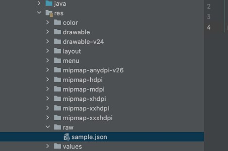

### Kode : Raw Resource

```kt
sayHelloButton.setOnClickListener {
	val sample = resources.openRawResource(R.raw.sample)
		.bufferedReader()
		.use { it.readText() }

	Log.i("RAW", sample)
}
```

## #28 Context

- Dalam Android, terdapat object bernama Context. Context berisi global informasi tentang environment aplikasi. Context merupakan Abstract Class yang implementasikanya sudah dilakukan oleh Android
- Context memungkinkan kita mengakses resource, membuka activity, menerima intent, broadcasting, dan lain-lain
- https://developer.android.com/reference/android/content/Context

### Jenis Context

- Di Android, terdapat 2 jenis Context, Application Context dan Activity Context
- Application Context merupakan context yang tersedia di aplikasi Android. Dan hanya dibuat sekali alias singleton
- Application Context bisa diakses dengan function `getApplicationContext()`
- Activity Context merupakan context tersedia di Activity. Misal jika kita punya MainActivity, maka akan ada ActivityContext untuk MainActivity itu
- Activity Context bisa diakses langsung dengan Activity nya, karena Activity adalah turunan dari Context

### Kapan Menggunakan Context

- Application Context digunakan jika kita ingin membuat object yang singleton yang membutuhkan Context
- Activity Context digunakan jika kita ingin membuat object yang hanya digunakan di Activity tersebut
- Jangan menggunakan Activity Context untuk object yang singleton, karena nanti otomatis referensi ke Activity tersebut akan selalu ada, dan otomatis object Activity tidak bisa dihapus di memory Android, hal ini bisa menyebabkan memory leak

## #29 Application

- Application adalah base class untuk maintain global applicatin state
- Secara default Androud akan membuat object Application sendiri, namun kita juga bis membuat class Application sendiri, asal harus turunan dari class Application
- Dan untuk mendaftarkan class Application yang kita buat, kita harus daftarkan di Manifest File dengan tag `"android:name"`
- https://developer.android.com/reference/android/app/Application
- Untuk mendapatkan object Application, kita bisa menggunakan function `getApplication()` di Activity

### Kode : Application

```kt
class MyApplication : Application() {

	override fun onCreate() {
		super.onCreate()
		Log.i("APP", "Application created")
	}

}
```

### Kode : Manifest File

```xml
<?xml version="1.0" encoding="utf-8"?>
<manifest xlmns:android="http://schemas.android.com/apk/res/android"
	package="com.programmerzamannow.helloworld">

	<application
		android:name=".MyApplication"
		android:allowBackup="true"
		android:icon="@mipmap/ic_launcher"
		android:label="Hello World" >
	</application>
</manifest>
```

## #30 Device Compatibility

- Android di desain untuk bisa berjalan pada berbagai perangkat, dari smartphone, tablet sampai tv
- Banyaknya target perangkat yang bisa menjalankan Android menjadikan salah satu keuntungan, sehingga aplikasi kita bisa ditargetkan untuk banyak jenis perangkat
- Namun, agar aplikasi kis bisa berjalan dengan baik di berbagai jenis perangkat yang berbeda, aplikasi kita harus memastikan bise mentoleransi ketersediaan fitur pada perangkat keras, dan juga UI yang harus flexible yang bisa beradaptasi dengan ukuran layar yang berbeda-beda

### Controlling Application Availability

- Android mendukung banyak sekali fitur yang bisa digunakan oleh aplikasi kita melalui Android Platform API. Beberapa fitur ada yang berbasis hardware (misal compass sendor dan fingerprint), beberap berbasis software (misal app widgets), dan beberapa tergantung versi platform
- TIdak semua perangkat Android mendukung semua fitur, jadi kita harus mengontrol aplikasi kisa berdasarkan fitur yang terdapat pada perangkat nya
- Untuk mengontrol perangkat yang bisa menjalankan aplikasi kita, kita bisa menggunakan dua cara secare declarative atau programmatic
- Declarative artinya kita simpan pada konfigurasi aplikasi, hal ini menyebabkan kondisi wajib
- Programmatic artinya kita cek di kode aplikasi kita, jadi pengecekan dilakukan saat aplikasi berjalan

### Device Feature di Manifest File

- Contoh jike kita mewajibkan sebuah file ada di device, dan jika tidak ada maka aplikasi kita tidak bisa berjalan, maka kita bisa tambahkan di manifest file
- Contoh, jika aplikasi kita berbasis compass sensor, maka tidak berguna juga jika device nya tidak memiliki fitur tersebut, sehingga kita bisa mewajibkan perangkat yang memiliki fitur compass sensor
- Jika perangkat tidak memiliki fitur itu, secara otomatis dia tidak bisa menginstall aplikasi kita

### Kode : Device Feature di Manifest File

```xml
<?xml version="1.0" encoding="utf-8"?>
<manifest xlmns:android="http://schemas.android.com/apk/res/android"
	package="com.programmerzamannow.helloworld">

	<uses-feature android:name="android.hardware.fingerprint" android:required="true" />
	<uses-feature android:name="android.hardware.nfc" android:required="true" />

	<application
		android:name=".MyApplication"
		android:allowBackup="true"
		android:icon="@mipmap/ic_launcher"
		android:label="Hello World" >
	</application>
</manifest>
```

### Device Feature di Kode

- Namun jika misal fitur yang kita butuhkan hanya optional, misal contohnya fingerprint ada fitur yang boleh ada atau tidak, kita bisa cukup melakukan pengecekan di kode program kita saja
- Kita bisa menggunakan class PackageManager untuk mengeceknya
- https://developer.android.com/reference/content/pm/PackageManager
- Dan untk mendapatkan object PackageManager, kita bisa gunakan function `getPackageManager()`

### Kode : Package Manager

```kt
if (packageManager.hasSystemFeature(PackageManager.FEATURE_FINGERPRINT)) {
	Log.i("FEATURE", "enabled fingerprint feature")
} else {
	Log.i("FEATURE", "disabled fingerprint feature")
}
```

### Platform Version

- Saat kita memnbuat Android, kadang kita ingin mendukung versi dari platform yang minimal versi berapa
- Dan setiap veri platform Android rilis, biasanya akan membawa fitur baru, sehingga kita perlu tahu juga, fitur yang terdapat di Androud tersebut ada sejak versi platform berapa

### Kode : Platform Version

```gradle
android {
	compileSdk 32

	defaultConfig {
		applicationId "com.programmerzamannow.helloworld"
		minSdk 29
		targetSdk 32
		versionCode 1
		versionName "1.0"
	}
}
```

### Kode : Pengecekan Versi Platform

```kt
if (Build.VERSION.SDK_INT < Build.VERSION_CODES.S) {
	// menggnakan versi dibawah 32
	Log.i("VERSION", "disabled some features")
}
```

## #31 Screen Compatibility

- Android berjalan di perangkat dengan berbagai ukuran, dari smartphone, tablet sampai tv
- Untuk mengkategorisasikan perangkat berdasarkan ukuran layar, Android mendefinisikan dalam dua karakteristik, screen size (ukuran layar) dan screen desity (kepadatan pizel layar, atau DPI)
- Untuk mempermudah dan menggeneralisasi semua varian ini. Android membagi menjadi beberapa grup
- Screen size : small, normal, large, dan xlarge
- Screen density : mdpi (medium), hdpi (high), xhdpi (extra high), xxhdpi (extra-extra high) dan others
- Android default, aplikasi kita akan kompatibel dengan semua screen size dan dencity, karena Android akan melakukan penyesuaian layout UI dan gambar untuk tiap perangkat layar
- Namun untuk pengalaman yang lebih baik, ada baiknya kita menggunakan resource yang sesuai dengan tiap jenis layar

### Pixel Densities

- Saat kita akan mendukung perangkat yang kepadatan pixelnya berbeda-beda, maka agak menyulitkan ketika kita ingin membuat komponen yang ukurannya fix, misal menggunakan pixel
- Contoh jika kita menggunakan komponen dengan ukuran 100px, maka akan terlihat besar di layar yang density nya kecil, tapu akan terlihat kecil jika diukuranya diukuran layar yang density nya besar
- Oleh karena itu, di Android, kita jarang menggunakan ukuran px, melainkan ukuran dp (density-independent pixels)
- Ukuran dp bisa secara otomatis membesar sesuai dengan screen density
- Jika kita ingin menghitung berapa pixel dari dp, kita bisa gunakan rumus : `px = dp * (dpi / 160)`
- https://developer.android.com/training/multiscreen/screendensities
  | Density qualifer | Description |
  | ---------------- | ----------- |
  | ldpi | Resources for low-density (ldpi) screens (~120dpi). |
  | mdpi | Resources for medium-density (mdpi) screens (~160dpi). (this is the baseline density.) |
  | hdpi | Resources for high-density (hdpi) screens (~240dpi). |
  | xhdpi | Resources for extra-high-density (xhdpi) screens (~320dpi). |
  | xxhdpi | Resources for extra-extra-high-density (xxhdpi) screens (~480dpi). |
  | xxxhdpi | Resources for extra-extra-extra-high-density (xxxhdpi) screens (~640dpi). |

### Kode : Density Independent Pixels

```xml
<ImageView
    android:layout_width="100dp"
    android:layout_height="100dp"
    android:layout_gravity="center_horizontal"
    android:contentDescription="PZN Logo"
    android:src="@drawable/pzn"
    />
```

## #32 Resource Compatibility

- Pada materi Localization, kita sudah tahu bahwa resource itu bisa mendukung multi bahasa
- Di Android, resource juga mendukung multi compatibility
- Misal, ketika kita membuat gambar ukuran 100px, gambar ini akan terlihat bagus di perangkat dengan density rendah, tapi ketika menggunakan perangkat dengan density tinggi, maka gambar itu akan kemungkinan akan pecah
- Oleh karena itu, kadang kita perlu mendukung beberapa jenis resource tergantung dari perangkat yang ingin kita dukung

### Membuat Resource dengan Compatibility

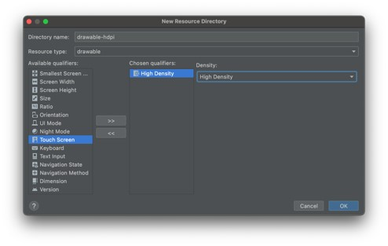

## #33 Debugging

- Saat membuat aplikasi, kesalahan sering terjadi
- Dan kadang, agak sulit untuk mencari kesalahan tersebut, sehingg kita buth menelusuri alur kode program kita satu per satu
- Unungnya, Android memiliki fitur debugging, dimana kita bisa menghentikan program yang sedang berjalan, dan melanjutkan jalannya program secara bertahap sesaui yang kita inginkan
- Fitur ini sangat tergantung dengan Android Studio

### Kode : Debugging

```kt
private fun printHello(name: String) {
    Log.i("DEBUG" name)
}
```


### Menjalankan dalam Mode Debug


## #34 Testing

- Testing adalah salah satu tahapan dalam pembuatan aplikasi, termasuk di Android
- Android sudah mendukung testing dengan baik, baik itu unit test sampai end to end test

### Jenis Testing di Android

- Instrumented Test, yaitu test yang diljalankan di perangkat Android, baik itu physical atau emulator. Aplikasi akan di install di perangkat Android, lalu test akan melakukan pengetesan pada aplikasi yang berjalan dengan mengirim perintah-perintah, Instrumented Test bisa dibilang juga Integration Test atau End to End Test.
- Local Test, yaitu test yang dieksekusi di development machine kita, misal di laptom atau di server. Biasanya local test itu kecil dan cepat, dan biasanya di dalam local test tidak membutuhkan device Android untuk berjalan. Kita bisa bilang juga dengan nama Unit Test.


### Kenapa Automation Testing Penting?

- Dengan menjalankan test terhadap aplikasi kita secara konsisten, kita bisa memverifikasi kebenaran aplikasi kita, fungsionalitas aplikasi, sebelum kita merilis aplikasi ke public
- Sebenarnya kita bisa saja melakukan test secara manual, dengan cara menjalankan aplikasi di Device, lalu mencoba semua fitur
- Namun, manual test sulit untuk dikerjakan secara konsisten, rentang kesalahan dan jika butuh cepat, tidak bisa dilakukan secara otomatis juga
- Oleh karena itu automation test sangat penting dalam pengembangan aplikasim terutama aplikasi Android

## #35 Local Test

- Android Menggunakan JUnit untuk melakukan Unit Test atau Local Test
- Pada saat dibuatnya video ini, versi JUnit yang digunakan oleh Android masih menggunakan JUnit 4, padahal versi terbaru andalaj JUnit 5
- Namun jangan khawatir, karena jika kita sudah terbiasa menggunakan JUnit 5, harusnya akan lebih mudah menggunakan JUnit 4

### Folder Unit Test

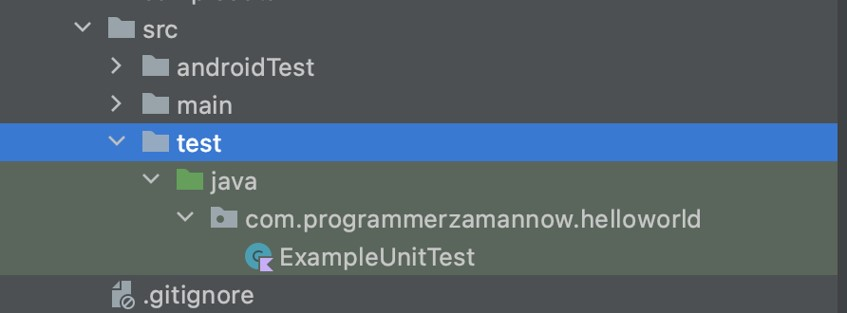

## #36 Instrumentation Test

- Unit Test hanya bisa digunakan untuk melakukan pengetesan kode program kita
- Saat kita membuat aplikasi Android, kadang banyak sekali ketergantungan dengan sistem operasi Androud nya itu sendiri, oleh karena itu kadang sulit untuk membuat unit test ketika kita butuh melakukan pengetesan interaksi dengan UI aplikasi kita
- Android mendukung Instrumentation Test, atau sederhananya adalah UI Test Automation
- Dengan menggunakan Instrumentation Test, kit bisa membuat automation test mirip robot, yang mensimulasikan pengguna aplikasi kita

### Expresso

- JUnit hanya digunakan untuk Library Unit Test, untuk melakukan UI Test, Android menggunakan library bernama Espresso
- Dengan Espresso, kita bisa membuat UI Test dengan mudah
- Ada banyak sekali fitur Espresso, dan kita akan belajar secara bertahap di roadmak kelas Android ini
- https://developer.android.com/training/testing/espresso

### Activity Scenario

- Saat kita melakukan instrumentation test, biasanya kita akan melakukan UI Test, dan untuk menampilkan UI, kita biasanya butuh Activity
- Dalam Instrumentation Test, kita bisa menggunakan ActivityScenario untuk menjalankan sebuah Activity
- https://developer.android.com/reference/android/test/core/app/ActivityScenario

### Kode : Activity Scenario

```kt
@RunWiwh(AndroudJUnit4::class)
class MainActivityTest {

    lateinit var activityScenario: ActivityScenario<MainActivity>

    @Before
    fun setUp() {
        activityScenario = ActivityScenario.launch(MainActivity::class.java)
    }

    @After
    fun tearDown() {
        activityScenario.close()
    }
}
```

### Actvity Scenario Rule

- Menjalankan Activity secara manual menggunakan Activity Scenario tidak direkomendasikan ketika kita membuat Instrumentation Test
- Kita bisa memanfaatkan ActivityScenarioRule yang bisa di integrasikan dengan JUnit Rule, yang secara otomatis bisa manjalankan Activity ketika unit test mulai dan menghentikan Activity ketika unit test selesai
- https://developer.android.com/reference/androidx/test/ext/junit/rules/ActivityScenarioRule

### Kode : Activity Scenario Rule

```kt
@RunWith(AndroudJUnit4:class)
class MainActivityTest {

    @get:Rule
    var activityScenarioRule = ActivityScenarioRule(MainActivity::class.java)
}
```

### Espresso Package

- Espresso berisikan banyak class yang bisa digunakan untuk mempermudah kita melakukan Instrumentation Test
- Karena terlalu banyak, jadi kita akan membahasnya sambil kelasnya berjalan, dan sambil kita praktekan
- Package Espresso ada di androidx.test.espresso
- https://developer.android.com/reference/androidx/test/espresso/package-summary?hl=en

### Kode : Instrumentation Test

```kt
@Test
fun testMainActivity() {
    val context = ApplicationProvider.getApplicationContext<Context>()
    val name = "Eko"

    Espresso.onView(ViewMatchers.withId(R.id.nameEditText))
        .perform(ViewActions.typeText(name))

    onView(withId(R.id.sayHelloButton))
        .perform(click())

    onView(withId(R.id.sayHelloTextView))
        .check(matches(withText(context.getString(R.string.sayHelloTextView, name))))

}
```

## #37 Profiling

- Debugging, Unit Test dan instrumentation Test adalah salah satu cara untuk meminimalisir kesalahan ketika membuat aplikasi
- Namun kadang-kadang ada msalah yang mungkin tidak terdetaksi oleh debugging, unit test atau bahkan instrumentation test
- Contoh yang sering terjadi adalah masalah memory leak
- Pada kasus ini, fitur Profiling, dimana kita bisa memonitor aplikasi kita yang berjalan
- Kita bisa memonitor penggunaan memory, cpu dan lain-lain

### Profiler

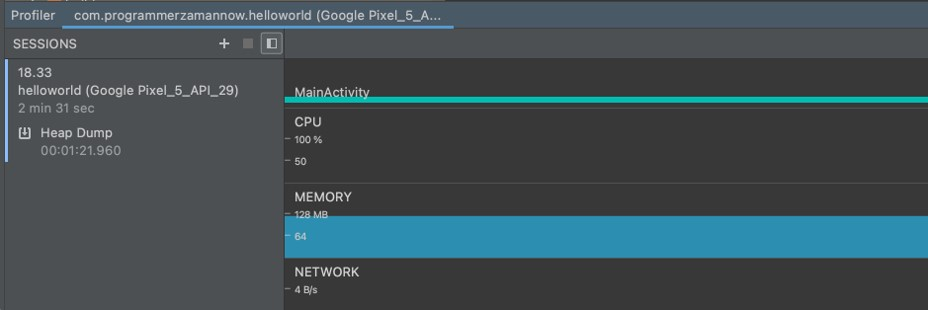

## #38 Reset Android Studio

- Kadang ada kalanya kita sering menghadapi error ketika membuka atau menjalankan project Android, entah error di Android SDK nya, atau error di Android Studio nya
- Pada kasus yang error seperti ini, yang tidak ada hubungannya dengan kode program kita, kita bisa mencoba melakukan reset Android Studio kita
- Harapanya adalah, kita bisa membuka Androud Studio seperti ketika pertama kali kita menginstall Android Studio

### Hapus Emulator

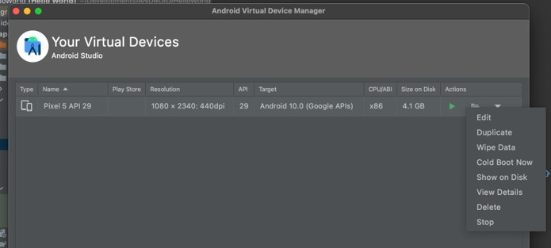

### Hapus Android SDK


### Invalidate Cache


## #39 Membuat Game Batu Gunting Kertas

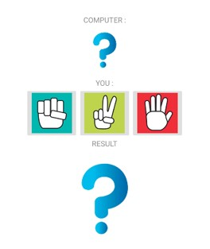

## Materi Selanjutnya

- Android Activity
- Android Layout
- Android App Navigation
- Android UI
- Dan lain-lain
